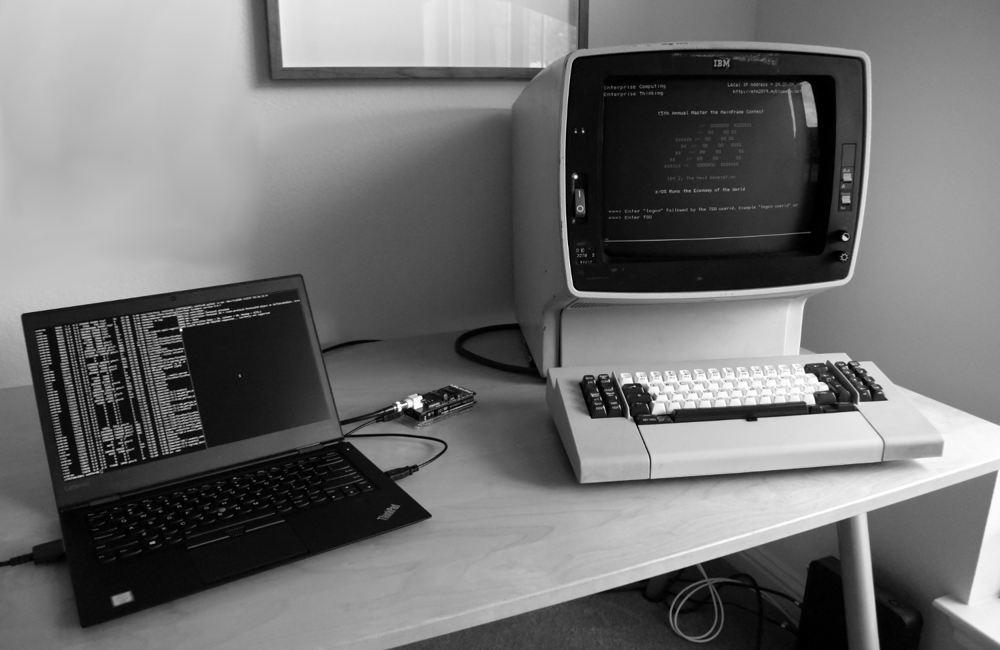

# oec

IBM 3270 terminal controller - a replacement for the IBM 3174.



This project aims to create an open replacement for the IBM 3174 Establishment
Controller, specifically for users looking to connect an IBM 3270 type terminal
to the Hercules emulator.

For background on this project, IBM 3270 type terminals and controllers, see
_[Building an IBM 3270 terminal controller](https://ajk.me/building-an-ibm-3270-terminal-controller)_.

## Features

It is a work in progress and is far from providing all the features you might
expect from a later model 3174, but it does provide basic TN3270 and VT100
emulation.

  - [x] TN3270
      - [x] Basic TN3270
      - [ ] Extended Data Stream
      - [ ] TN3270E
      - [ ] SSL/TLS
  - [x] VT100
  - [ ] Connection Menu
  - [ ] MLT (Multiple Logical Terminals)

## Supported Terminals

Only directly attached CUT (Control Unit Terminal) type terminals are supported. I have tested oec with the following terminals:

  * IBM 3278-2
  * IBM 3472
  * IBM 3483-V (InfoWindow II)

You may have to modify the key mapping to support your specific terminal configuration.

## Usage

You will need to
[build](https://github.com/lowobservable/coax#hardware)
or
[buy](https://www.tindie.com/products/approachware/3270-usb-interface-ibm/)
a compatible interface.

You will need Python 3.8, or above, installed.

I'd recommend using a Python [virtual environment](https://docs.python.org/3/library/venv.html) to isolate oec from your system-wide packages:

```
python3.8 -m venv VIRTUALENV
source VIRTUALENV/bin/activate
```

Install dependencies using `pip`:

```
pip install -r requirements.txt
```

Assuming your interface is connected to `/dev/ttyACM0` and you want to connect to a TN3270 host named `mainframe`:

```
python -m oec /dev/ttyACM0 tn3270 mainframe
```

If you want to use the VT100 emulator and run `/bin/sh` as the host process:

```
python -m oec /dev/ttyACM0 vt100 /bin/sh -l
```

VT100 emulation is not supported on Windows. It may work with Python on Cygwin, but I've not tested it.

## See Also

* [coax](https://github.com/lowobservable/coax) - Tools for connecting to real IBM 3270 type terminals
* [pytn3270](https://github.com/lowobservable/pytn3270) - Python TN3270 library

If you are looking for a similar project for IBM 5250 (Twinax) type terminals, see
inmbolmie's
[5250_usb_converter](https://github.com/inmbolmie/5250_usb_converter)
project.
